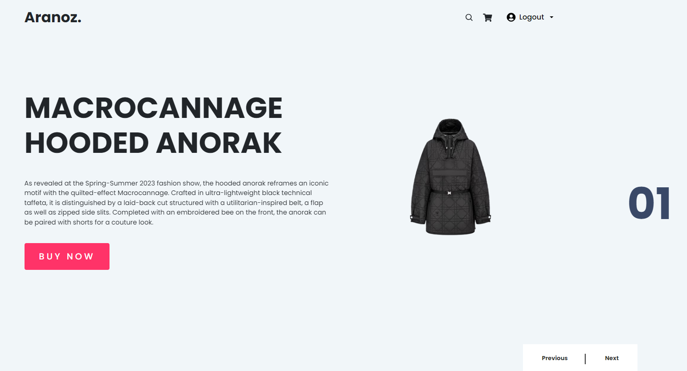

# Aranoz ecommerce Web Application


## Overview
This project is an online store where customers may browse and make purchases. The website has a responsive design that functions on desktop and mobile devices and was created using contemporary web technology. Users will receive a seamless purchasing experience and a user-friendly interface as a result of this project.

## Features
### Client
Buy product<br>
Review product<br>
Login<br> 
Logout<br> 
### Dashboard
Statistical dashboard<br>
ADD/EDIT/DELETE product<br>
ADD/EDIT/DELETE user<br>
DELETE order<br>

## Technologies
ExpressJS<br>
ReactJS<br>
SASS<br>
MongoDB<br>
Bootstrap<br>

## Getting Started

First, run the development server:

```bash
npm start
# or
yarn dev
# or
pnpm dev
```

Open [http://localhost:3006](http://localhost:3006) with your browser to see the result.

You can login admin dashboard with this account:
```bash
ID: admin@example.com
Password: 1
```

## Conclusion
Thank you for checking out the Aranoz ecommerce website! If you have any questions or feedback, please feel free to contact me. I hope you enjoy using this website as much as I enjoyed building it!